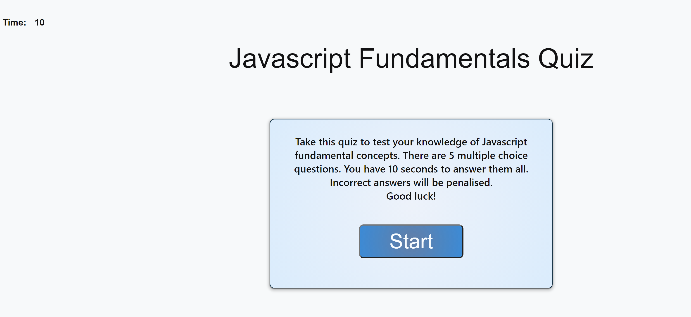
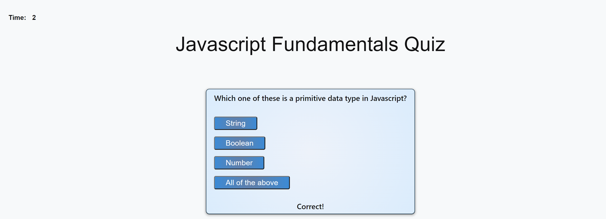
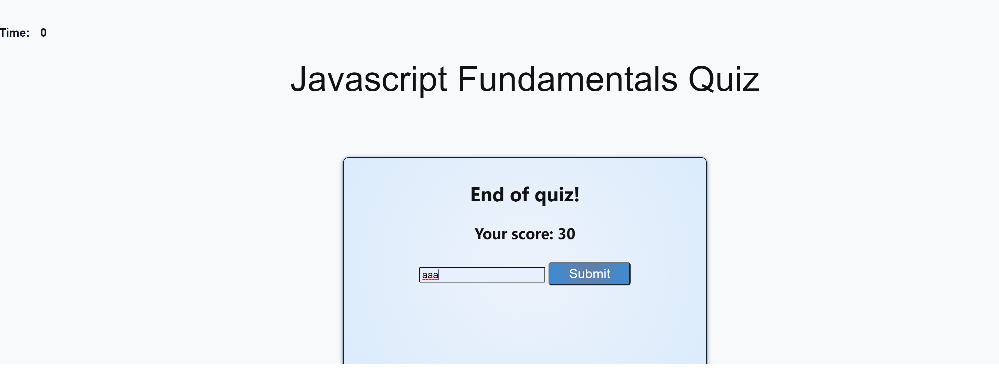

# HW04-Code-Quiz
# Overview

In this assignment I have tried to build a timed code quiz application that presents the user with a few Javascript fundamental questions. The user can choose an answer from a set of four options. These answer options are clickable buttons. When the user selects an answer, the application verifies the user input and displays the result on the card. The application then progresses to the next question until all the questions are answered or the quiz times out.

The quiz has 5 questions to be answered in 10 seconds.Each correct answer rewards the user with 10 points. Incorrect answers are penalized by deducting 2 seconds from the timer.

The user is allowed to save his score with his initials. There are options to clear the saved scores and go back to the start page.

The application is responsive and can scale to smaller screens.

Screen shots:
1. 
2. 
3. 
4. 

1. ![Deployed application]: https://chaitra-srinivas.github.io/HW04-Code-Quiz/
2. ![Github link]: https://github.com/chaitra-srinivas/HW04-Code-Quiz
